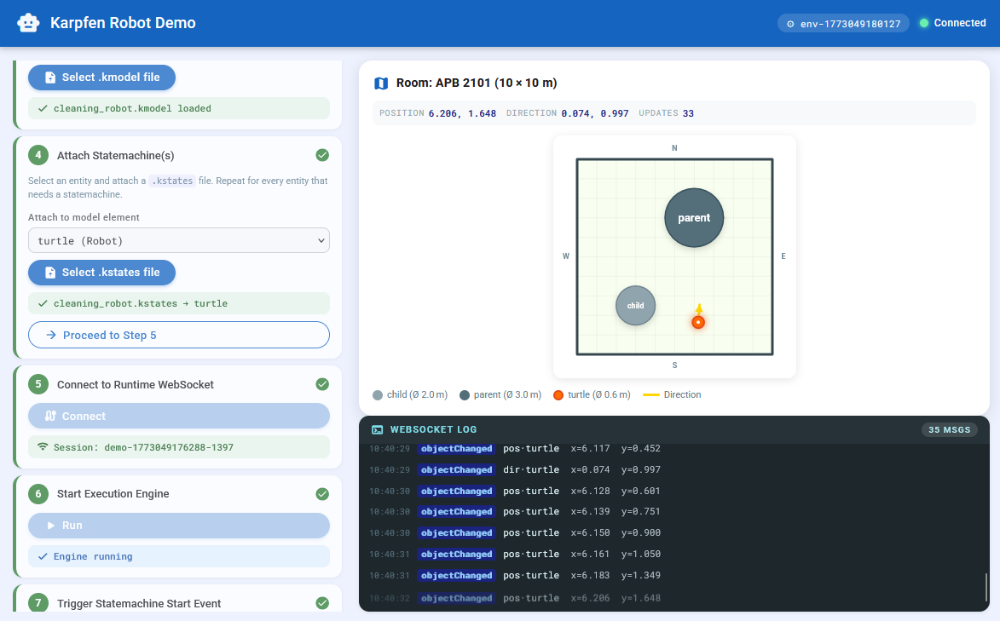

# robot-model-js-client-demo
A karpfen engine demo with the execution engine running as a server and a visual minimal frontend in javascript and HTML

**Important! This repository needs to be cloned with the --recursive flag!**



## Project Structure

- `webui.html` contains the single-page demo frontend
- `connector.js` contains all frontend networking code for communication with the karpfen runtime
- `kmodel-parser.js` parses `.kmodel` files client-side to discover observable object IDs
- `visualization.js` the canvas renderer for the 2D room/robot/obstacle world
- `styles.css` / `styles.js` generic UI shell, app bar, step cards, log panel, and chip components
- `run_local.sh` / `run_docker.sh` server startup scripts (see [Running the Demo](#running-the-demo))
- `demo-input-files/` contains the example model files for this demo:
  - `cleaning_robot.kmeta` the metamodel file for this demo
  - `cleaning_robot.kmodel` the world model (data model) for this demo
  - `cleaning_robot.kstates` the robot state machine for this demo (moves the robot)
  - `moving_child.kstates` the state machine for moving the child (can be optionally attached)
  - `moving_parent.kstates` the state machine for moving the parent (can be optionally attached)
- `karpfen-runtime/` the execution engine (Git submodule - see its own [documentation](./karpfen-runtime/README.md))

## About the Karpfen Toolkit

Karpfen is a **model-driven execution framework** built around three domain-specific languages and a lightweight runtime server.

| Layer | What it does |
|---|---|
| **KMeta** (`.kmeta`) | Defines type hierarchies - classes, properties, composition (`has`), and references (`knows`) |
| **KModel** (`.kmodel`) | Instantiates a concrete world model from a KMeta metamodel |
| **KStates** (`.kstates`) | Attaches hierarchical statecharts to model objects; supports `ENTRY`/`DO` phases, prioritised transitions, `NOT LOOPING` guards, Python-embedded `EVAL` expressions, and reusable `MACRO` definitions |
| **karpfen-runtime** | Stateless Kotlin/Ktor HTTP server that hosts execution environments in-memory; exposes a REST API and a WebSocket push channel for live object-change and domain-event notifications |

**Highlighted features:**
- Multiple independent execution environments per server instance, each with its own model and statemachine set
- Hierarchical states with proper state-stack semantics and per-level ENTRY/DO execution
- Fine-grained WebSocket subscriptions: observe individual model object properties or entire event domains
- Tick-based execution loop with configurable delay and optional execution tracing

**Further reading:**

*Runtime*
- [Getting Started](./karpfen-runtime/guides/GETTING_STARTED.md) - prerequisites, configuration, end-to-end workflow
- [HTTP API Endpoints](./karpfen-runtime/guides/HTTP_API_ENDPOINTS.md) - full REST + WebSocket API reference
- [Statemachine Execution Semantics](./karpfen-runtime/guides/STATEMACHINE_EXECUTION_SEMANTICS.md) - tick loop, transition priority, event model
- [Quick Reference](./karpfen-runtime/guides/QUICK_REFERENCE.md) - commands, endpoints, and troubleshooting at a glance

*DSL grammars*
- [KMeta Grammar Guide](./karpfen-runtime/karpfen-dsl-tools/guides/kmeta_grammar_guide.md)
- [KModel Grammar Guide](./karpfen-runtime/karpfen-dsl-tools/guides/kmodel_grammar_guide.md)
- [KStates Grammar Guide](./karpfen-runtime/karpfen-dsl-tools/guides/kstates_grammar_guide.md)


## About this Specific Demo

This project provides an interactive demo for the `karpfen-runtime` model execution service. By running this demo, you get familiar with all setup and interaction possibilities of the karpfen-runtime. Still, before using karpfen in your own projects, we recommend reading all available karpfen documentation.

After starting the demo (see next section) you can open a HTML view (webui.html). This UI comprises of three parts. A setup panel on the upper left side where you are guided through the setup steps until the environment is running. A websocket log panel on the lower left side and the world model simulation view on the right side (centered).

The log and setup panels are explained in the step-wise instructions in the next section.

**For more information about the karpfen-engine, please consult their respective [documentation](https://github.com/karpfenproject/karpfen-runtime)**


### World-Model Visualization

The provided models (`cleaning_robot.kmeta|kmodel|kstates`) encode a world comprising a quadratic room with fixed dimensions. This room contains two round obstacles with fixed positions and a robot (turtle) which also has a round bounding box.
The robot can move around the room. The robot's data object therefore comprises its current position as a vector and its moving direction as a vector. 

The world model visualization shows this 2D scene graphically. It depicts the room as a simple square and the obstacles and the robot as differently colored circles. The robot's movement vector is depicted as a small arrow.

The statechart which is executed on the karpfen-server modifies the movement vector and position values of the turtle robot during its execution. This frontend subscribes to (observes) these values via karpfen-runtimes websocket interface to consistently update the provided visualization.

## Running the Demo

**Important! This repository needs to be cloned with the --recursive flag!**

### Prerequisites

The karpfen-runtime can be started in two ways: **locally** on the host system, or inside a **Docker container**.  Choose the approach that suits your setup.

#### Local run prerequisites
- Java 21+ as default java home in the PATH (`java --version` = 21.x)
- Python 3.12+ available in the PATH via `python`, `python3` or `py`

#### Docker run prerequisites
- Docker Engine (or Docker Desktop) installed and the `docker` CLI available in the PATH

### Starting the Demo

**Before starting**, edit `karpfen-runtime/application.conf` to match your desired configuration. Neither start script overwrites this file - you own it. See the inline comments in `application.conf` for a description of every option, including how to configure the trace log directory for Docker runs.

#### Local run

```bash
./run_local.sh
```

Builds the karpfen-runtime using the Java and Python installations on the host system and starts the server directly.  The server runs in the foreground; press `Ctrl+C` to stop it.

#### Docker run

```bash
./run_docker.sh [HOST_LOG_DIR]
```

Builds a Docker image (`debian:trixie-slim` runtime, `eclipse-temurin:21-jdk` builder) and starts it as a one-shot container that is removed automatically when stopped.  `HOST_LOG_DIR` is an optional path on the host where engine trace log files will be written (default: `karpfen-runtime/logs`).  To actually receive trace files there, enable tracing in `application.conf` and set `tracingLogDirectory = "/app/logs"` (the container-side mount point).

```conf
engineTracing {
  tracingEnabled      = true
  tracingLogDirectory = "/app/logs"
}
```

**Note:** The `karpfen-runtime/application.conf` is bind-mounted read-only into the container, so any edits you make to it take effect on the next `./run_docker.sh` invocation.

---

After the server is running (by either method), open `webui.html` in your browser.
There, you can now execute the following actions in order (the webui ensures the order). You may observe the output of the runtime on the terminal meanwhile (stdout and stderr are propagated).

Some configurations in this demo-setup are specifically designed for the provided example models. So although the application asks you to submit models manually, please only select the provided ones. If you know what you are doing, you can play with the statemachine model but without touching the data model or metamodel. Otherwise this demo's visualizations may break.

1. Click *Create Execution Environment*. This requests a new environment in the runtime and returns an envKey which is now displayed.
2. Load the metamodel via the now visible *Load Metamodel* button. There you select the `cleaning_robot.kmeta` in the file picker. This action sends the metamodel to the runtime and registers it in the created environment.
3. Load the model via the now visible *Load Model* button. There, you select the `cleaning_robot.kmodel` in the file picker. This action sends the model to the runtime.
4. Load the statemachine via the now visible *Attach Statemachine(s)* step. First, pick the target model element from the inline **Attach to model element** dropdown (populated automatically from the uploaded model - select `turtle`). Then click *Select .kstates file* and pick `cleaning_robot.kstates`. The statemachine is uploaded and appears in the list below the dropdown. You can attach additional statemachines to other model elements by repeating this sub-step. When you are done, click *Proceed to Step 5*.
5. (Automated) When uploading the statemachine, the client is automatically registered with the server and observers are set up for all relevant data objects: the robot's `position` and `direction` vectors, and the `position` vectors of all obstacles. These subscriptions are derived from the parsed kmodel and are specific to this demo model.
6. After everything is setup, you can connect to the runtime websocket for live data. Doing so gives you a session key. After connecting successfully, a green status badge appears.
7. Now, you can start the statemachine via the visible `run` button next to it. This also activates a status log view which displays any incoming websocket messages asynchronously.
8. The statemachine should now be running in the runtime. However it is designed in such a way that it requires a dedicated start event to go from the initial state into a self-sufficient run loop. You can trigger the prepared event by clicking on the now available `trigger statemachine initial event` action button.
9. The statemachine now runs until you send a `kill engine` message via the respective action button. While the statemachine is running, you can observe the following behaviour:
    1. In the websocket log, you see arriving data updates from the observed data objects (turtle position)
    2. In the simulation screen, you see the discretely moving turtle based on the updated position values from the websocket.

### This is a Domain-specific Demo!

**What is domain specific here?**

Several parts of this repository are tightly coupled to the *cleaning robot* domain and cannot be reused for other karpfen projects without modification:

- **The model files** (`cleaning_robot.kmeta`, `cleaning_robot.kmodel`, `cleaning_robot.kstates`) - these encode the entire robot domain: the metamodel type hierarchy (Room, Robot, Obstacle, TwoDObject, Vector, …), a concrete world instance (room dimensions, initial robot position/direction, two fixed obstacles), and an obstacle-avoidance statemachine with custom macros.
- **`kmodel-parser.js`** - parses `.kmodel` files according to the *specific structure* defined by `cleaning_robot.kmeta`. It hard-codes knowledge of property names (`robot`, `boundingBox`, `position`, `direction`, `obstacles`, `walls`, `diameter`, `x`, `y`, …). A different metamodel would require a different parser.
- **`visualization.js`** - the canvas renderer is tailored to the 2D room/robot/obstacle world. It knows about rooms, cardinal directions, circular bounding boxes, and direction arrows. None of this applies to an unrelated domain.
- **The hard-coded start event** - `triggerStartEvent()` in `connector.js` sends `EVENT("public", "start")`, which matches the transition guard in `cleaning_robot.kstates`. A different statemachine would require a different trigger.
- **The observer subscriptions** - the IDs of the robot's position/direction vectors and each obstacle's position vector are extracted from the parsed kmodel and passed to `configureSubscriptions()`. This wiring is specific to how the cleaning robot metamodel nests its data objects.

**What are general reusable parts?**

These parts are not tied to the cleaning robot domain and work with any karpfen-runtime project:

- **`connector.js` (`KarpfenConnector`)** - HTTP + WebSocket client for the karpfen-runtime REST API. It wraps the full lifecycle (`createEnvironment`, `setMetamodel`, `setModel`, `setStateMachine`, `connectWebSocket`, `runAndStart`, `triggerStartEvent`, `killEngine`) behind a promise-based API and knows nothing about any specific domain model. You can copy it into any web frontend that talks to karpfen-runtime.
- **The setup wizard flow in `webui.html`** - the eight-step sequence (create environment, load metamodel, load model, attach statemachine, connect WebSocket, run engine, trigger start event, stop engine) mirrors the standard karpfen execution lifecycle. The step-card HTML and progression logic work for any karpfen project.
- **`run_local.sh` / `run_docker.sh`** - the server startup scripts are reusable; just edit `application.conf` before running.
- **`styles.css` / `styles.js`** - the UI shell, app bar, step cards, log panel, and chip components are generic and not robot-specific.

### How it Works (Oversimplified)

The demo connects a plain HTML/JS frontend to the **karpfen-runtime**, a model-execution server that runs statecharts against a structured world model.

1. **HTTP setup phase** - `connector.js` calls the karpfen-runtime REST API to assemble an execution environment:
  - `POST /createEnvironment` → returns an `envKey` that identifies this session.
  - `PUT /setMetamodel` - uploads the `.kmeta` type definitions.
  - `PUT /setModel` - uploads the `.kmodel` world instance. In parallel, `kmodel-parser.js` reads the uploaded text client-side to discover the object IDs of all entities that need to be observed.
  - `PUT /setStateMachine?attachedTo=turtle` - uploads the `.kstates` statechart and binds it to the `turtle` robot object. Immediately after, the client registers itself (`POST /registerClientForWebSocket`) and subscribes to every relevant data object (`POST /registerObjectObserver`) and the `"public"` event domain (`POST /registerDomainListener`).

2. **Execution start** - `POST /runEnvironment` initialises the execution engine, and `POST /startEnvironment` begins the tick loop. The statemachine starts in the `"ready"` state and waits.

3. **WebSocket connection** - the browser opens `ws://localhost:8080/ws` and authenticates by sending `clientId:envKey:accessKey` as the first message. The server then streams JSON push messages to this client whenever subscribed data changes.

4. **Statemachine activation** - the frontend sends `{environmentKey: "public", messageType: "start"}` over the WebSocket. This satisfies the `EVENT("public", "start")` transition guard in the statemachine, moving the robot out of `"ready"` and into the observe/drive loop.

5. **Live updates** - on every engine tick (~50 ms), the statemachine evaluates transitions and updates the robot's `boundingBox->position->x/y` values in the world model. Whenever a subscribed property changes, the server sends an `objectChanged` WebSocket message containing the object ID and its new property map. `connector.js` dispatches this to the `onObjectChanged` callback, which updates the mutable `robot` state object in `visualization.js` and schedules a canvas repaint via `requestAnimationFrame`.

---

*Parts of this project have been developed with the usage of generative AI.*